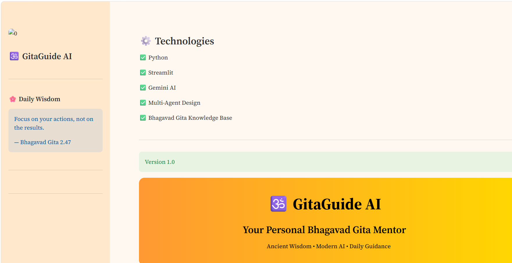
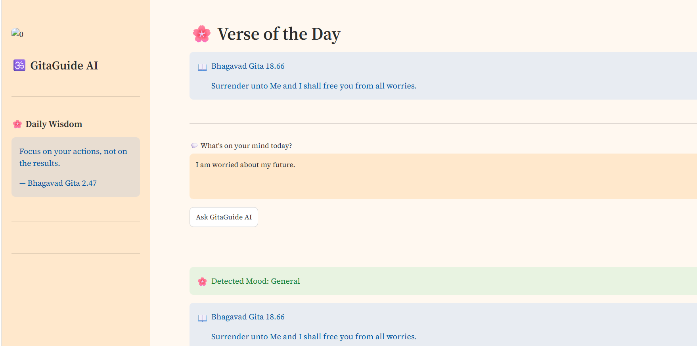
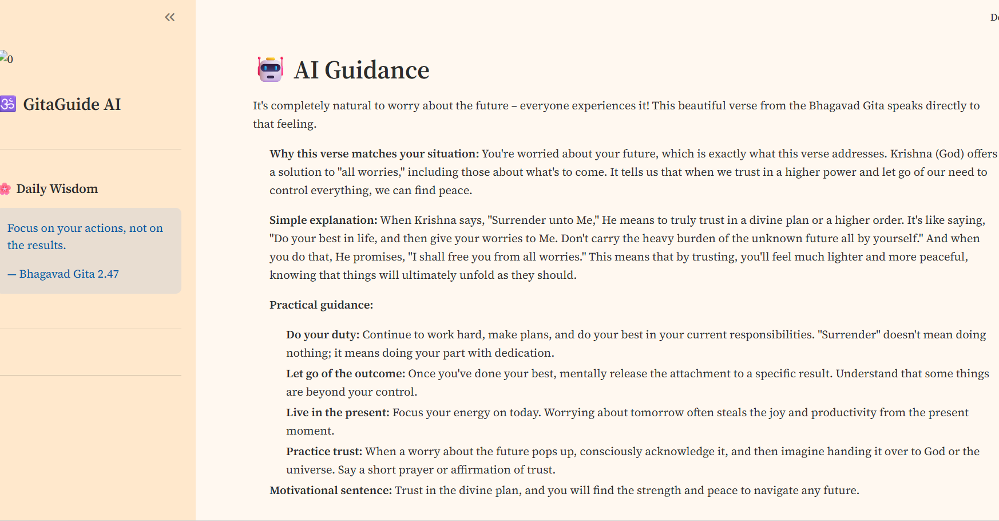
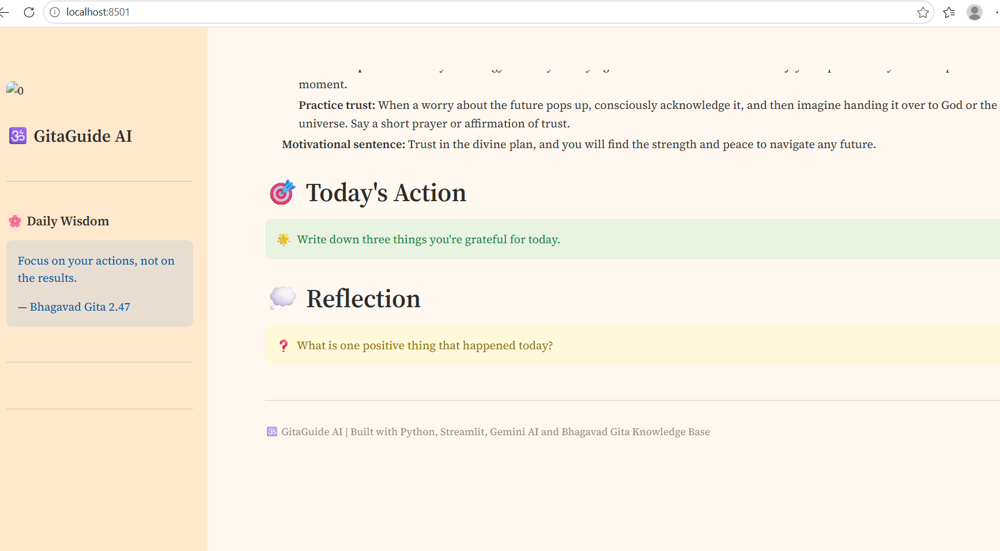

# 🕉️ GitaGuide AI

> **AI-powered Bhagavad Gita Mentor using Multi-Agent AI and Gemini**


---

## 🌟 Overview

GitaGuide AI is an AI-powered spiritual guidance application inspired by the **Bhagavad Gita**. It understands the user's emotions, recommends relevant verses, generates AI-powered guidance using Gemini, and suggests practical actions and reflection questions.

This project demonstrates **Multi-Agent AI Architecture** using Python and Streamlit.

---
## 🌐 Live Demo

🚀 Try the app here:

https://gita-guide-ai-f8lavayycad4hurnremdwx.streamlit.app/

# ✨ Features

- 🤖 AI Guidance using Gemini AI
- 📖 Bhagavad Gita Verse Recommendation
- 🧠 Mood Detection Agent
- 🎯 Action Suggestion Agent
- 💭 Reflection Question Agent
- 🌸 Daily Bhagavad Gita Verse
- 💬 Interactive Chat Interface
- ⚡ Fast and Simple Streamlit UI

---

# 📸 Screenshots

## 🏠 Home Page



---

## 💬 Chat Interface



---

## 📖 AI Guidance



---

## 🌸 Final Output



---

# 🏗️ Architecture

```text
                User
                  │
                  ▼
          Mood Detection Agent
                  │
                  ▼
          Verse Recommendation
                  │
                  ▼
            Gemini AI Response
                  │
        ┌─────────┼─────────┐
        ▼         ▼         ▼
    Guidance   Action   Reflection
```

---

# ⚙️ Tech Stack

- Python
- Streamlit
- Google Gemini AI
- JSON
- Multi-Agent Design

---

# 📂 Project Structure

```text
gita-guide-ai/
│
├── assets/
│   ├── home.png
│   ├── home1.png
│   ├── home2.png
│   └── home3.png
│
├── data/
│   └── verses.json
│
├── app.py
├── chatbot.py
├── ai_mood_agent.py
├── mood_agent.py
├── verse_agent.py
├── action_agent.py
├── reflection_agent.py
├── README.md
├── requirements.txt
└── .gitignore
```

---

# 🚀 Installation

```bash
git clone https://github.com/maha-2424/gita-guide-ai.git

cd gita-guide-ai

pip install -r requirements.txt

streamlit run app.py
```

---

# 🎯 Future Improvements

- 🎤 Voice Krishna AI
- 📚 Complete 700 Bhagavad Gita Verses
- 🌍 Multi-language Support
- 📱 Mobile Responsive UI
- ☁️ Streamlit Cloud Deployment
- ❤️ Bookmark Favorite Verses

---

# 👩‍💻 Author

**Mahalakshmi Reddy**

Aspiring Software Developer | AI Enthusiast

---

# ❤️ Made With

Python ❤️ Streamlit ❤️ Gemini AI ❤️ Bhagavad Gita